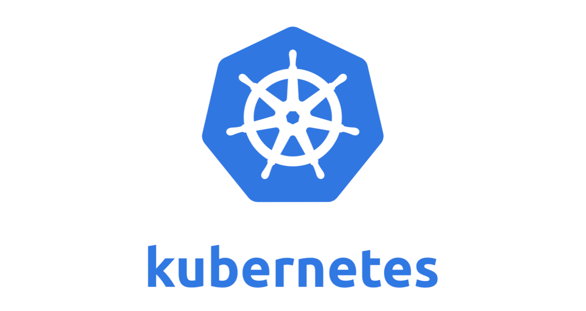

# project-analysis
该repo主要用于由浅及深的深入分析优秀的开源项目，如：最近特别火的云原生社区中的kubernetes项目，分布式处理框架圈中的新贵Flink等，我们针对这些优秀的开源社区，通过从整体架构宏观的角度开始到底层源码的分析，由浅及深的阅读、分析、分享以及讨论这些优秀项目的工作原理以及细节，时间不在长短，我们的目标是读完它，看透它。

## kubernetes

作为CNCF的重要的开源项目，kubernetes是用于自动部署，扩展，和管理容器化应用程序的开源系统，它将组成应用程序的容器组合成逻辑单元，以便于管理和服务发现。

